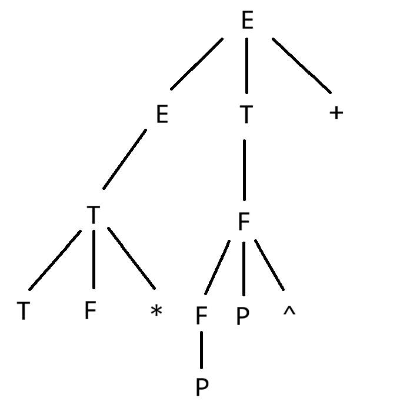
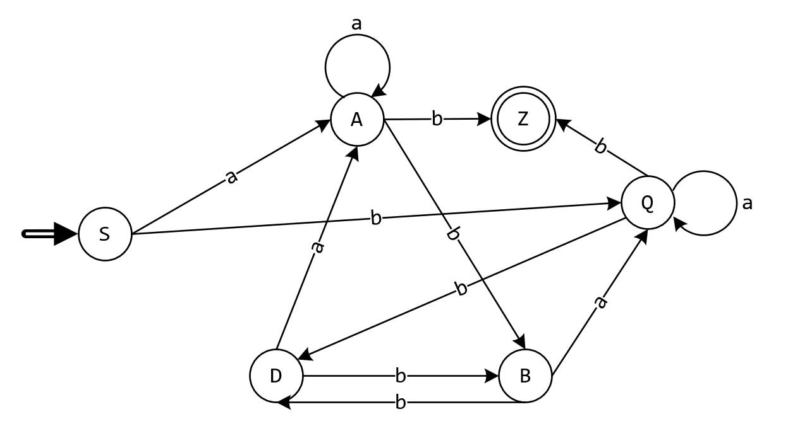
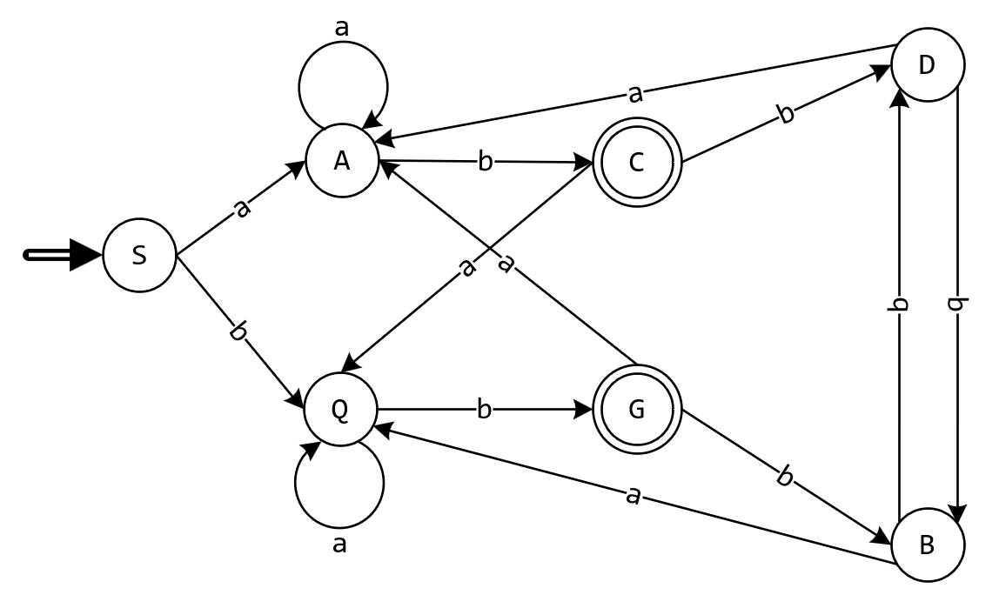
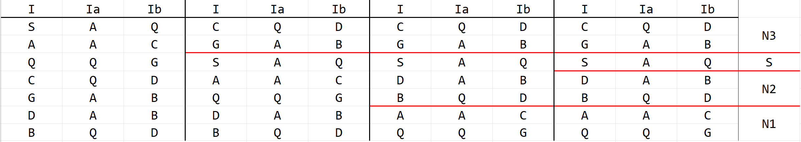
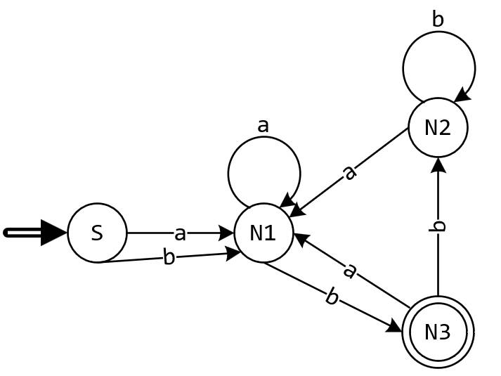
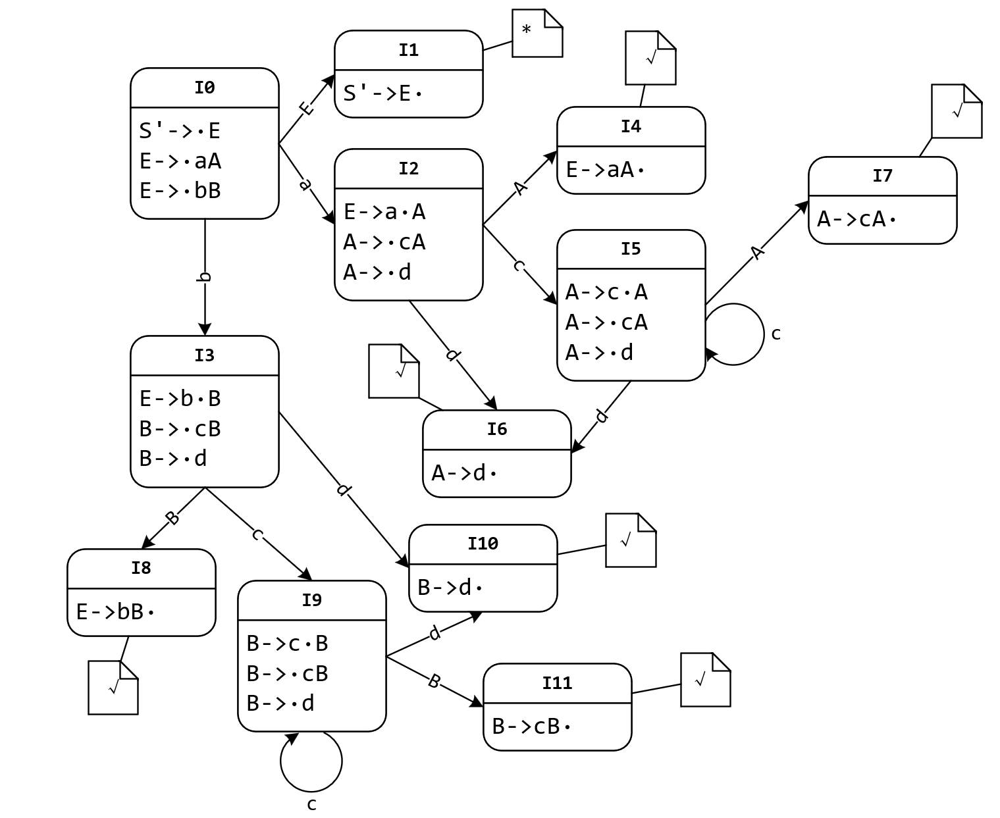
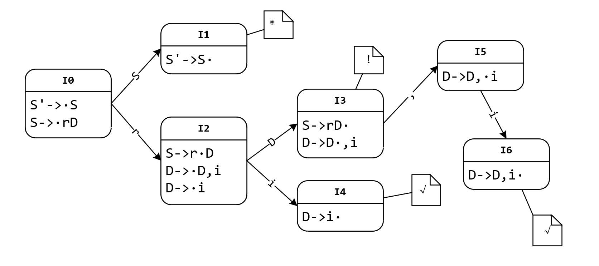
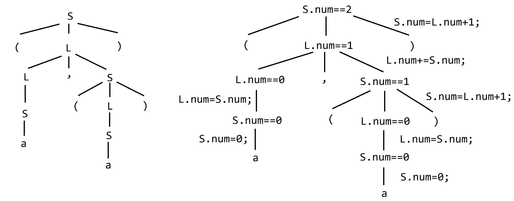

# 编译原理

## 引论

### 编译过程概述

编译程序由以下 8 个核心阶段组成：

词法分析、语法分析、语义分析、中间代码生成、代码优化、目标程序生成、表格管理、出错处理。

流程：

源程序 -> 词法分析 -> 语法分析 -> 语义分析 -> 中间代码生成 -> 代码优化 -> 目标程序生成 -> 目标程序

其中表格管理、出错处理贯穿整个流程。

---

编译过程前后端的划分：

- **前端**：与源语言相关，与目标机器无关，包含词法分析、语法分析、语义分析、中间代码生成等；
- **后端**：与目标机器相关，与源程序语言无关。

### 编译与解释

编译与解释的区别及优缺点

- **编译**：一次性将源程序全部翻译为目标机器码，生成可执行文件，之后独立运行。
- - 优点：运行速度快，性能好，不修改源程序的情况下每次执行不用重新编译。
  - 缺点：编译过程耗时，兼容性较差，调试不便。
- **解释**：将源程序代码逐行翻译并执行，不生成可执行文件。
- - 优点：兼容性强，调试直观，开发迭代快。
  - 缺点：运行速度慢，每次执行都需要重新编译。

## 文法和语言

文法 G 定义为四元组 (V_N, V_T, P, S)。其中，V_T 是终结符集合，V_N 是非终结符集合，P 为规则集，S 为开始符。

规定：V_T ∩ V_N = ∅；S 作为一个非终结符，至少要在一条规则中作为左值出现；通常用 V 代表 V_T ⋃ V_N，V 表示 G 的字母表。

L(G) 称为 G 的语言；用符号 | 表示或，上标符号 $^* $ 表示闭包，上标符号 $^+$ 表示正闭包，ɛ 表示这里没有字符。

如 $a^*$ 表示 ɛ、a、aa、aaa、……

$a^+$ 表示 a、aa、aaa、……

$a^n$ 表示 n 个字符 a 相连。

例：(1) 对于文法 G = ({ A,B,S }, {a,b,c}, P, S)，其中 P 为：

S->Ac|aB

A->ab

B->bc

则 L(G[S]) = { abc }。

(2) 对于文法 G[Z]：

Z -> aZb

Z -> ab

则 L(G[Z]) = { $a^nb^n$ | $n≥1$ }。

## 文法的类型

### 例1：

对于文法 G[S]：S->S(S)S|ɛ，写出 G 的语言，并分析该文法是否是二义的。

**解：**

L(G[S]) 为并列或嵌套的括号对。

句型 `()()` 的语法树：

![G[S] 语法树](文法G[S]语法树.jpg "文法 G[S] 的句型 ()()")

由于 G[S] 的一种句型 `()()` 的语法树有两种表示，因此，该文法是二义的。

### 例2：

给定文法 G[E]：

E->ET+|T

T->TF*|F

F->FP^|P

P->(E)|i

求该文法的句型 `TF*PP^+` 的语法树、短语、直接短语、句柄。

**解：**

语法树：



短语：`TF*` 、`PP^` 、`P` 、`TF*PP^+` ；

直接短语：`TF*` 、`P` ；

句柄：`TF*` 。

## 词法分析

### 文字表达、正规式、不确定的有穷状态自动机(NFA)的相互转换

#### 例1：

对以下字母表为 { 0,1 } 的正规式转换为文字表达：

(1) $0^*(10^+)^*0^*$

每一个 1 后面都至少紧跟着一个 0 的所有串。

(2) $(0|1)^*(00|11)(0|1)^*$

包括连续的两个 0 或两个 1 的所有串。

(3) $1(0|1)^*0$

以 1 开头，以 0 结尾的所有串。

#### 例2：

对以下文字表达转化为正规式：

(1) 以 ab 结尾的所有串： $(a|b)^*ab$

(2) 只包含一个 a 的所有串： $b^*ab^*$

(3) 包含 ab 子串的所有串： $(a|b)^*ab(a|b)^*$

#### 例3：

文法 G：S->0A|1B    A->1S|1    B->0S|0

写出文法 G 的正规式。

**解：** $(10|01)^+$

#### 正规式转换为 NFA

字母表：{ a,b }，圆圈代表各种状态

(1) $ab$


(2) $a|b$


(3) $a^*$


#### 正规文法转换为正规式

| 文法产生式           | 正规式      |
|:---------------:|:--------:|
| $A→xB$    $B→y$ | $A=xy$   |
| $A→xA\|y$       | $A=x^*y$ |
| $A→x$    $A→y$  | $A=x\|y$ |
| $A→xA\|x$       | $A=x^+$  |

### 有穷自动机

#### 定义

一个**确定的有穷自动机**(DFA) M 是一个五元组 $M = (K, Σ, f, S, Z)$，其中

K 是一个有穷集，其每个元素都是一个状态；

Σ 是一个不包括 ɛ 的有穷字母表，其每个元素都是一个输入符号；

f 是转换函数(单值函数)，例如 $f(k_i, a)=k_j (k_i∈K, k_j∈K)$ 表示当前状态为 $k_i$，输入字符为 $a$ 时，将转换至下一状态 $k_j$；

$S∈K$，是唯一的一个初态；

$Z⊆K$，是一个终态集，终态也称可接受状态或结束状态。

---

一个**不确定的有穷自动机**(NFA) M 是一个五元组 $M = (K, Σ, f, S, Z)$，其中

K 是一个有穷集，其每个元素都是一个状态；

Σ 是一个可以包括 ɛ 的有穷字母表，其每个元素都是一个输入符号；

f 是转换函数(多值函数)，例如 $f(k_i, a)=k_j, k_n (k_i, k_j, k_n∈K)$ 表示当前状态为 $k_i$，输入字符为 $a$ 时，既可转换至状态 $k_j$，也可转换至状态 $k_n$；

$S⊆K$，是一个非空初态集；

$Z⊆K$，是一个终态集，终态也称可接受状态或结束状态。

#### 例

对于文法 G[S]：

S->aA|bQ    A->aA|bB|b    B->bD|aQ    Q->aQ|bD|b    D->bB|aA
E->aB|bF    F->bD|aE|b

构建该文法的 NFA，随后将其转换为 DFA，并最小化。

**解：**

由于 E、F 为不可到达状态，因此删除。首先构建 NFA：



将 NFA 转化为 DFA：

ɛ-closure({S}) = {S}

ɛ-closure(δ({S}, a)) = {A}

ɛ-closure(δ({S}, b)) = {Q}

……

| 状态重命名 | $I$   | $I_a$ | $I_b$ |
|:-----:|:-----:|:-----:|:-----:|
| S     | {S}   | {A}   | {Q}   |
| A     | {A}   | {A}   | {B,Z} |
| Q     | {Q}   | {Q}   | {D,Z} |
| C     | {B,Z} | {Q}   | {D}   |
| G     | {D,Z} | {A}   | {B}   |
| D     | {D}   | {A}   | {B}   |
| B     | {B}   | {Q}   | {D}   |

得到 DFA：



随后最小化 DFA：



得到：

| $I$   | $I_a$ | $I_b$ |
|:-----:|:-----:|:-----:|
| $S$   | $N_1$ | $N_1$ |
| $N_1$ | $N_1$ | $N_3$ |
| $N_2$ | $N_1$ | $N_2$ |
| $N_3$ | $N_1$ | $N_2$ |

最后得到最小化 DFA：



## 语法分析

### LL(1)分析

#### 题目1

对于一个文法G[S]：

S->MH|a

H->LSo|ε

L->eHf

M->K|bLM

K->dML|ε

判断该文法是否是 LL(1) 文法，如果是则求此文法的 LL(1) 分析表，并分析串 `efao#` （\#为结束符）是否可被此文法G[S]接受。

**解：**

> 设 G = (V_N, V_T, P, S) 是上下文无关文法，V_T 是终结符集合，V_N 是非终结符集合，则
> 
> FIRST(α) = { a|α => aβ, a ∊ V_T, α,β ∊ V* }
> 
> 其中，若 α => ɛ，则规定 ɛ ∊ FIRST(α)。称 FIRST(α) 为 α 的**开始符号集**或**首符号集**。
> 
> ---
> 
> 设 G = (V_N, V_T, P, S) 是上下文无关文法，A ∊ V_N，S 是开始符号，则
> 
> FOLLOW(A) = { a|S => μAβ 且 a ∊ V_T, a ∊ FIRST(β), μ ∊ V_T*, β ∊ V+ }
> 
> 若 S => μAβ，且 β => ɛ，则 \# ∊ FOLLOW(A)。其中 \# 为输入串的结束符，类似 \\0。
> 
> 也可定义为 FOLLOW(A) = { a|S => …Aa… , a ∊ V_T }，若有 S => …A，则规定 \# ∊ FOLLOW(A)。
> 
> 称 FOLLOW(A) 为 A 的**后跟符号集**。
> 
> ---
> 
> 若一个上下文无关文法的规则 P 包含产生式 A->α，A ∊ V_N，α ∊ V*，若 α ⇏ ɛ，则 SELECT(A->α) = FIRST(α)；
> 
> 若 α => ɛ，则 SELECT(A->α) = (FIRST(α) - { ɛ }) ∪ FOLLOW(A)。
> 
> 称 SELECT(A->α) 为产生式 A->α 的**选择符号集**。
> 
> ---
> 
> 注：A => a 指 A 经过一次或多次推导后可以推导出 a；A ⇏ a 指 A 无论如何最终无法推导出 a。

首先，求出 FIRST 和 FOLLOW 集：

| 集合类型   | S             | H         | L               | M         | K         |
|:------:|:-------------:|:---------:|:---------------:|:---------:|:---------:|
| FIRST  | { a,b,d,ε,e } | { e,ε }   | { e }           | { d,ε,b } | { d,ε }   |
| FOLLOW | { #,o }       | { #,f,o } | { a,b,d,e,o,# } | { e,#,o } | { e,#,o } |

随后，求出各个产生式的 SELECT 集：

SELECT(S->MH) = { b,d,e,#,o }

SELECT(S->a) = { a }

SELECT(H->LSo) = { e }

SELECT(H->ε) = { #,f,o }

SELECT(L->eHf) = { e }

SELECT(M->K) = { d,#,e,o }

SELECT(M->bLM) = { b }

SELECT(K->dML) = { d }

SELECT(K->ε) = { e,#,o }

由于

SELECT(S->MH) ∩ SELECT(S->a) = Ø

SELECT(H->LSo) ∩ SELECT(H->ε) = Ø

SELECT(M->K) ∩ SELECT(M->bLM) = Ø

SELECT(K->dML) ∩ SELECT(K->ε) = Ø

因此该文法 G[S] 是 LL(1) 文法。

之后，根据 SELECT 集构造 LL(1) 分析表 `L[V_N][V_T]` ：

|     | a    | #     | o     | e      | f    | b      | d      |
|:---:|:----:|:-----:|:-----:|:------:|:----:|:------:|:------:|
| S   | S->a | S->MH | S->MH | S->MH  |      | S->MH  | S->MH  |
| H   |      | H->ε  | H->ε  | H->LSo | H->ε |        |        |
| L   |      |       |       | L->eHf |      |        |        |
| M   |      | M->K  | M->K  | M->K   |      | M->bLM | M->K   |
| K   |      | K->ε  | K->ε  | K->ε   |      |        | K->dML |

其中，空白表示报错。

分析串 `efao#` ：

|     栈 |  输入 |       操作        |
| -----: | ----: | :---------------: |
|     S# | efao# | L\[S][e] = S->MH  |
|    MH# | efao# |  L\[M][e] = M->K  |
|    KH# | efao# |  L\[K][e] = K->ε  |
|     H# | efao# | L\[H][e] = H->LSo |
|   LSo# | efao# | L\[L][e] = L->eHf |
| eHfSo# | efao# |      匹配 e       |
|  HfSo# |  fao# |  L\[H][f] = H->ε  |
|   fSo# |  fao# |      匹配 f       |
|    So# |   ao# |  L\[S][a] = S->a  |
|    ao# |   ao# |      匹配 a       |
|     o# |    o# |      匹配 o       |
|      # |     # |       接受        |

因此，串 `efao#` 可被文法 G[S] 接受。

#### 题目2

对于文法 G[E]：

E->TE'

E'->+E|ɛ

T->FT'

T'->T|ɛ

F->PF'

F'->\*F'|ɛ

P->(E)|a|b|^

求其 FIRST 和 FOLLOW 集。

解：

|  集合  |     E     |   E'   |     T     |     T'      |        F        |       F'        |          P          |
| :----: | :-------: | :----: | :-------: | :---------: | :-------------: | :-------------: | :-----------------: |
| FIRST  | {(,a,b,^} | {+,ɛ}  | {(,a,b,^} | {(,a,b,^,ɛ} |    {(,a,b,^}    |     {\*,ɛ}      |      {(,a,b,^}      |
| FOLLOW |  {\#,)}   | {\#,)} | {+,\#,)}  |  {+,\#,)}   | {(,a,b,^,+,#,)} | {(,a,b,^,+,#,)} | {\*,(,a,b,^,+,\#,)} |

#### 某些非 LL(1) 文法至 LL(1) 文法的等价转换

##### 提取左公共因子

由于 LL(1) 文法一定不含有左公共因子，因此应该提取并消除文法出现的左公共因子。

假定关于 A 的规则是

A->ab|ac|ad|ae|…|an

含有左公共因子 a，提取左公共因子后可得到

A->aA'

A'->b|c|d|e|…|n

**例：**对于文法 G[A]：

A->ad

A->Bc

B->aA

B->bB

提取左公共因子将其转化为 LL(1) 文法：

A->aA'|bBc

A'->d|Ac

B->aA|bB

##### 消除左递归

自上而下分析中经常会出现“无限循环”的问题，即一个文法含有左递归，如存在非终结符 A 的产生式

A->Aα

对于这种文法，在用 A 进行匹配输入串时，会出现没有进入任何输入符号的情况下，又要对 A 进行匹配，因此需要消除左递归。

假定 A 的全部产生式是：

$A→Aa_1|Aa_2|…|Aa_m|b_1|b_2|…|b_n$ 

其中每个 a 都不等于 ɛ，每个 b 都不以 A 开头。

消除左递归后改成：

$A→b_1A'|b_2A'|…|b_nA'$ 

$A'→a_1A'|a_2A'|…|a_mA'|ɛ$ 

**例：**对于文法 G[S]：

S->Qc|c

Q->Rb|b

R->Sa|a

消除左递归。

**解：**设文法的非终结符排序为 R、Q、S。

对于 R 不存在直接左递归，将 R 代入至 Q 的相关候选后，Q 的规则变为：

Q->Sab|ab|b

现在 Q 不含直接左递归，代入至 S 的相关候选后，S 变为：

S->Sabc|abc|bc|c

随后，消除 S 的左递归后，得到整个文法：

S->abcS'|bcS'|cS'

S'->abcS'|ɛ

Q->Sab|ab|b

R->Sa|a

由于 Q、R 是不可到达状态，因此删除。最终得到：

S->abcS'|bcS'|cS'

S'->abcS'|ɛ

**注：**由于对非终结符排序的不同，最后所得文法形式上可能不同，但是是等价的。

### LR(0)分析

#### 题目

对于一个文法G：

E->aA

E->bB

A->cA

A->d

B->cB

B->d

求此文法的分析表，并分析串 `bccd#` 是否可被此文法G接受。

**解：**

根据此文法G，增加 S'->E 将其变为拓广文法，并添加文法规则（编号）如下：

(0) S'->E    (1) E->aA    (2) E->bB    (3) A->cA    (4) A->d

(5) B->cB    (6) B->d

> LR(0) 项目集规范族的项目中包含以下4种项目：
> 
> - **移进项目**：圆点后为终结符的项目；
> - **归约项目**：圆点在产生式最右端的项目；
> - **待约项目**：圆点后为非终结符的项目；
> - **接受项目**：形如拓广产生式，且圆点在最右端的项目，如 `S'->E·` 。

构造识别活前缀的 DFA (即 LR(0) 项目集规范族，其中，\* 表示接受项目(状态)，√ 表示归约项目(状态))：



当一个状态中同时存在移进项目和归约项目，则此状态存在**移进-归约冲突**；当一个状态中存在多个归约项目，则此状态存在**归约-归约冲突**。由于上面的 LR(0) 项目集规范族中不存在 移进-归约冲突 和 归约-归约冲突，因此该文法是 LR(0) 文法。

随后构造 LR(0) 状态分析表：

| 状态  | a      | b      | c      | d      | \#     | E    | A    | B    |
|:---:|:------:|:------:|:------:|:------:|:------:|:----:|:----:|:----:|
|     | ACTION | ACTION | ACTION | ACTION | ACTION | GOTO | GOTO | GOTO |
| 0   | S2     | S3     |        |        |        | 1    |      |      |
| 1   |        |        |        |        | acc    |      |      |      |
| 2   |        |        | S5     | S6     |        |      | 4    |      |
| 3   |        |        | S9     | S10    |        |      |      | 8    |
| 4   | r1     | r1     | r1     | r1     | r1     |      |      |      |
| 5   |        |        | S5     | S6     |        |      | 7    |      |
| 6   | r4     | r4     | r4     | r4     | r4     |      |      |      |
| 7   | r3     | r3     | r3     | r3     | r3     |      |      |      |
| 8   | r2     | r2     | r2     | r2     | r2     |      |      |      |
| 9   |        |        | S9     | S10    |        |      |      | 11   |
| 10  | r6     | r6     | r6     | r6     | r6     |      |      |      |
| 11  | r5     | r5     | r5     | r5     | r5     |      |      |      |

说明：

- `Sn` 表示**移进**并转移到状态n；
- `rk` 表示用第k个产生式（编号为k的产生式）**归约**；
- `acc` 表示**接受**；
- 空白 表示**报错**。

根据以上分析表来分析串 `bccd#` ：

| Steps | State stack | Symbol stack | Input string | ACTION |       GOTO       |
| :---: | :---------- | :----------- | -----------: | :----: | :--------------: |
|   1   | 0           | #            |        bccd# |   S3   |                  |
|   2   | 03          | #b           |         ccd# |   S9   |                  |
|   3   | 039         | #bc          |          cd# |   S9   |                  |
|   4   | 0399        | #bcc         |           d# |  S10   |                  |
|   5   | 0399(10)    | #bccd        |            # |   r6   | GOTO\[9][B] = 11 |
|   6   | 0399(11)    | #bccB        |            # |   r5   | GOTO\[9][B] = 11 |
|   7   | 039(11)     | #bcB         |            # |   r5   | GOTO\[3][B] = 8  |
|   8   | 038         | #bB          |            # |   r2   | GOTO\[0][E] = 1  |
|   9   | 01          | #E           |            # |  acc   |                  |

因此，串 `bccd#` 可被该文法接受。

### SLR(1) 分析

#### 题目1

对于一个文法G(S)：

S->rD

D->D,i

D->i

求此文法的分析表，并分析串 `ri,i,i#` 是否可被此文法接受。

**解：**

根据此文法G(S)，增加 S'->S 将其变为拓广文法，并添加文法规则（编号）如下：

(0) S'->S    (1) S->rD    (2) D->D,i    (3) D->i

构造识别活前缀的 DFA (即 LR(0) 项目集规范族，其中，* 表示接受项目(状态)，√ 表示归约项目(状态)，! 表示存在冲突的项目(状态))：



由于上面的 LR(0) 项目集规范族中，状态 I3 存在移进-归约冲突(S->rD·  D->D·,i)，因此该文法不是 LR(0) 文法。

> 若一个 LR(0) 项目集规范族中存在以下项目集(状态) I：
> 
> I = { X->α·bβ, A->γ·, B->δ· }
> 
> 其中，α、β、γ、δ为文法符号串，b为终结符，则 X->α·bβ 为移进项目，A->γ· 、 B->δ· 均为归约项目。如果满足
> 
> FOLLOW(A) ∩ FOLLOW(B) = Ø
> 
> FOLLOW(A) ∩ {b} = Ø
> 
> FOLLOW(B) ∩ {b} = Ø
> 
> 则在状态 I 时，如果面临某输入符号为 a，则可以按以下规定决策：
> 
> - 若 a = b，则移进(Sn)；
> - 若 a ∊ FOLLOW(A)，则用产生式 A->γ 进行归约(rn)；
> - 若 a ∊ FOLLOW(B)，则用产生式 B->δ 进行归约(rn)；
> - 此外，报错。
> 
> 若状态 I 中包含多个移进和多个归约项目，也可以按照上面的规定进行决策。
> 
> 如果文法的 LR(0) 项目集规范族的所有冲突都可以以上述方式解决，则称此文法为 SLR(1) 文法。

由于 FOLLOW(S) ∩ { , } = { \# } ∩ { , } = Ø，所以该文法为 SLR(1) 文法。

构建 SLR(1) 状态分析表：

| 状态  | r      | ,      | i      | \#     | S    | D    |
|:---:|:------:|:------:|:------:|:------:|:----:|:----:|
|     | ACTION | ACTION | ACTION | ACTION | GOTO | GOTO |
| 0   | S2     |        |        |        | 1    |      |
| 1   |        |        |        | acc    |      |      |
| 2   |        |        | S4     |        |      | 3    |
| 3   |        | S5     |        | r1     |      |      |
| 4   | r3     | r3     | r3     | r3     |      |      |
| 5   |        |        | S6     |        |      |      |
| 6   | r2     | r2     | r2     | r2     |      |      |

说明：

- `Sn` 表示**移进**并转移到状态n；
- `rk` 表示用第k个产生式（编号为k的产生式）**归约**；
- `acc` 表示**接受**；
- 空白 表示**报错**。

分析串 `ri,i,i#` ：

| 步骤 | 状态栈 | 符号栈 |  输入串 | ACTION |      GOTO       |
| :--: | :----- | :----- | ------: | :----: | :-------------: |
|  1   | 0      | #      | ri,i,i# |   S2   |                 |
|  2   | 02     | #r     |  i,i,i# |   S4   |                 |
|  3   | 024    | #ri    |   ,i,i# |   r3   | GOTO\[2][D] = 3 |
|  4   | 023    | #rD    |   ,i,i# |   S5   |                 |
|  5   | 0235   | #rD,   |    i,i# |   S6   |                 |
|  6   | 02356  | #rD,i  |     ,i# |   r2   | GOTO\[2][D] = 3 |
|  7   | 023    | #rD    |     ,i# |   S5   |                 |
|  8   | 0235   | #rD,   |      i# |   S6   |                 |
|  9   | 02356  | #rD,i  |       # |   r2   | GOTO\[2][D] = 3 |
|  10  | 023    | #rD    |       # |   r1   | GOTO\[0][S] = 1 |
|  11  | 01     | #S     |       # |  acc   |                 |

因此，串 `ri,i,i#` 可以被文法接受。

#### 题目2

对于一个文法G(S)：

S->E

E->T

E->E+T

E->E-T

T->F

T->T\*F

T->T/F

F->(E)

F->i

终结符集合：{ +, -, \*, /, (, ), i }，非终结符集合：{ S, E, T, F }，

求此文法的分析表，并分析串 `i*(i-i)/(i+i)#` 是否可被此文法G(S)接受。

**解：**

根据此文法G(S)，增加 S'->S 将其变为拓广文法，并添加文法规则（编号）如下：

(0) S'->S    (1) S->E    (2) E->T    (3) E->E+T    (4) E->E-T

(5) T->F    (6) T->T\*F    (7) T->T/F    (8) F->(E)    (9) F->i

构造识别活前缀的DFA（此处省略），随后构造 SLR(1) 状态分析表：

| 状态  | +   | -   | \*  | /   | (   | )   | i   | \#  | S   | E   | T   | F   |
|:---:|:---:|:---:|:---:|:---:|:---:|:---:|:---:|:---:|:---:|:---:|:---:|:---:|
| 0   |     |     |     |     | S5  |     | S6  |     | 1   | 2   | 3   | 4   |
| 1   |     |     |     |     |     |     |     | acc |     |     |     |     |
| 2   | S7  | S8  |     |     |     |     |     | r1  |     |     |     |     |
| 3   | r2  | r2  | S9  | S10 |     | r2  |     | r2  |     |     |     |     |
| 4   | r5  | r5  | r5  | r5  |     | r5  |     | r5  |     |     |     |     |
| 5   |     |     |     |     | S5  |     | S6  |     |     | 11  | 3   | 4   |
| 6   | r9  | r9  | r9  | r9  |     | r9  |     | r9  |     |     |     |     |
| 7   |     |     |     |     | S5  |     | S6  |     |     |     | 12  | 4   |
| 8   |     |     |     |     | S5  |     | S6  |     |     |     | 13  | 4   |
| 9   |     |     |     |     | S5  |     | S6  |     |     |     |     | 14  |
| 10  |     |     |     |     | S5  |     | S6  |     |     |     |     | 15  |
| 11  | S7  | S8  |     |     |     | S16 |     |     |     |     |     |     |
| 12  | r3  | r3  | S9  | S10 |     | r3  |     | r3  |     |     |     |     |
| 13  | r4  | r4  | S9  | S10 |     | r4  |     | r4  |     |     |     |     |
| 14  | r6  | r6  | r6  | r6  |     | r6  |     | r6  |     |     |     |     |
| 15  | r7  | r7  | r7  | r7  |     | r7  |     | r7  |     |     |     |     |
| 16  | r8  | r8  | r8  | r8  |     | r8  |     | r8  |     |     |     |     |

说明：

- `Sn` 表示**移进**并转移到状态n；
- `rk` 表示用第k个产生式（编号为k的产生式）**归约**；
- `acc` 表示**接受**；
- 空白 表示**报错**。

分析串 `i*(i-i)/(i+i)#` （\#为结束符）：

| 步骤 | 状态栈           | 符号栈        |         输入串 | ACTION |       GOTO        |
| :--: | ---------------- | ------------- | -------------: | :----: | :---------------: |
|  1   | 0                | #             | i*(i-i)/(i+i)# |   s6   |                   |
|  2   | 0,6              | # i           |  *(i-i)/(i+i)# |   r9   |  GOTO\[0][F] = 4  |
|  3   | 0,4              | # F           |  *(i-i)/(i+i)# |   r5   |  GOTO\[0][T] = 3  |
|  4   | 0,3              | # T           |  *(i-i)/(i+i)# |   s9   |                   |
|  5   | 0,3,9            | # T *         |   (i-i)/(i+i)# |   s5   |                   |
|  6   | 0,3,9,5          | # T * (       |    i-i)/(i+i)# |   s6   |                   |
|  7   | 0,3,9,5,6        | # T * ( i     |     -i)/(i+i)# |   r9   |  GOTO\[5][F] = 4  |
|  8   | 0,3,9,5,4        | # T * ( F     |     -i)/(i+i)# |   r5   |  GOTO\[5][T] = 3  |
|  9   | 0,3,9,5,3        | # T * ( T     |     -i)/(i+i)# |   r2   | GOTO\[5][E] = 11  |
|  10  | 0,3,9,5,11       | # T * ( E     |     -i)/(i+i)# |   s8   |                   |
|  11  | 0,3,9,5,11,8     | # T * ( E -   |      i)/(i+i)# |   s6   |                   |
|  12  | 0,3,9,5,11,8,6   | # T * ( E - i |       )/(i+i)# |   r9   |  GOTO\[8][F] = 4  |
|  13  | 0,3,9,5,11,8,4   | # T * ( E - F |       )/(i+i)# |   r5   | GOTO\[8][T] = 13  |
|  14  | 0,3,9,5,11,8,13  | # T * ( E - T |       )/(i+i)# |   r4   | GOTO\[5][E] = 11  |
|  15  | 0,3,9,5,11       | # T * ( E     |       )/(i+i)# |  s16   |                   |
|  16  | 0,3,9,5,11,16    | # T * ( E )   |        /(i+i)# |   r8   | GOTO\[9][F] = 14  |
|  17  | 0,3,9,14         | # T * F       |        /(i+i)# |   r6   |  GOTO\[0][T] = 3  |
|  18  | 0,3              | # T           |        /(i+i)# |  s10   |                   |
|  19  | 0,3,10           | # T /         |         (i+i)# |   s5   |                   |
|  20  | 0,3,10,5         | # T / (       |          i+i)# |   s6   |                   |
|  21  | 0,3,10,5,6       | # T / ( i     |           +i)# |   r9   |  GOTO\[5][F] = 4  |
|  22  | 0,3,10,5,4       | # T / ( F     |           +i)# |   r5   |  GOTO\[5][T] = 3  |
|  23  | 0,3,10,5,3       | # T / ( T     |           +i)# |   r2   | GOTO\[5][E] = 11  |
|  24  | 0,3,10,5,11      | # T / ( E     |           +i)# |   s7   |                   |
|  25  | 0,3,10,5,11,7    | # T / ( E +   |            i)# |   s6   |                   |
|  26  | 0,3,10,5,11,7,6  | # T / ( E + i |             )# |   r9   |  GOTO\[7][F] = 4  |
|  27  | 0,3,10,5,11,7,4  | # T / ( E + F |             )# |   r5   | GOTO\[7][T] = 12  |
|  28  | 0,3,10,5,11,7,12 | # T / ( E + T |             )# |   r3   | GOTO\[5][E] = 11  |
|  29  | 0,3,10,5,11      | # T / ( E     |             )# |  s16   |                   |
|  30  | 0,3,10,5,11,16   | # T / ( E )   |              # |   r8   | GOTO\[10][F] = 15 |
|  31  | 0,3,10,15        | # T / F       |              # |   r7   |  GOTO\[0][T] = 3  |
|  32  | 0,3              | # T           |              # |   r2   |  GOTO\[0][E] = 2  |
|  33  | 0,2              | # E           |              # |   r1   |  GOTO\[0][S] = 1  |
|  34  | 0,1              | # S           |              # |  acc   |                   |

因此，输入串 `i*(i-i)/(i+i)` 可被文法接受。

## 语义分析和中间代码生成

### 语义分析

给定文法 G[S]：

S->(L)|a

L->L,S|S

相应于 G[S] 的一个属性文法(翻译模式)：

S->(L)        { `S.num := L.num + 1;` }

S->a          { `S.num := 0;` }

L->L_1,S      { `L.num := L.num + S.num;` }

L->S          { `L.num := S.num;` }

输入串 `(a,(a))` 的语法分析树和带标注语法树：



### 中间代码生成

#### 四元式

将表达式 `x = y op z` 转换为四元式为：`(op  y  z  x)`

其中， `op` 可以表示2元及以下的运算符操作，因此，x、y、z 中的每个位置都有可能为空。

**例：** 将以下C语言代码片段转换为四元式(变量 t1、t2、t3 已声明)：

```c
t1 = 12 - 6;
t2 = 2 * t1;
t3 = 42 / t2;
```

转换为四元式：

```tex
(1)    (-  12  6  t1)
(2)    (*  2  t1  t2)
(3)    (/  42  t2  t3)
```

#### 三元式

将表达式 `x op y` 转换为三元式为：`(op  x  y)`

其中，x、y操作的结果保存在整个三元式中，使用时直接标出三元式的序号即可。

例：

C语言代码片段 `x = a + b;` 转换为三元式为：

```tex
(1)    (+  a  b)
(2)    (=  (1)  x)
```

---

#### 例题

(1) 将以下C语言代码片段转换为三元式(变量 a、b、x 均已声明)：

```c
if (a + b > 10)
    x = 0;
else
    x = -1;
```

**解：**转换为三元式：

```tex
(1)    (+  a  b)
(2)    (>  (1)  10)
(3)    (FJ  (6)  (2))
(4)    (=  0  x)
(5)    (RJ  (7)  ɛ)
(6)    (=  -1  x)
(7)    (ɛ  ɛ  ɛ)
```

转换为 x86 架构汇编代码：

```nasm
MOV eax, a
ADD eax, b
CMP eax, 10
JLE ELSE
MOV ebx, 0
MOV x, ebx
JMP ENDIF
ELSE:
    MOV ebx, -1
    MOV x, ebx
ENDIF:
```

(2) 将以下C语言代码片段转换为三元式(变量 a、b 均已声明)：

``````c
a = 0;
while (a < 10)
{
    if (a / 2 == 0)
        a++;
    else
        a += 2;
}
b = a;
``````

解：转换为三元式：

``````tex
(1)    (=  0  a)
(2)    (<  a  10)
(3)    (FJ  (13)  (2))
(4)    (/  a  2)
(5)    (==  (4)  0)
(6)    (FJ  (10)  (5))
(7)    (+  a  1)
(8)    (=  (7)  a)
(9)    (RJ  (12)  ɛ)
(10)   (+  a  2)
(11)   (=  (10)  a)
(12)   (RJ  (2)  ɛ)
(13)   (=  a  b)
``````

转换为 x86 架构汇编代码：

``````nasm
MOV eax, 0
MOV a, eax
WHILE:
	CMP eax, 10
	JGE ENDWHILE
	MOV ax, eax
	CWD
	MOV bx, 2
	IDIV bx
	CMP ax, 0
	JNE ELSE
	INC eax
	MOV a, eax
	JMP ENDIF
	ELSE:
		ADD eax, 2
		MOV a, eax
	ENDIF:
	JMP WHILE
ENDWHILE:
MOV b, eax
``````

